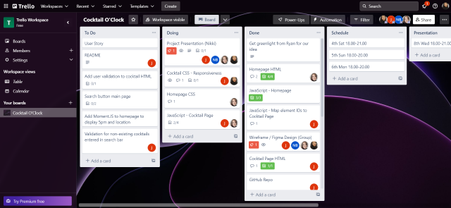
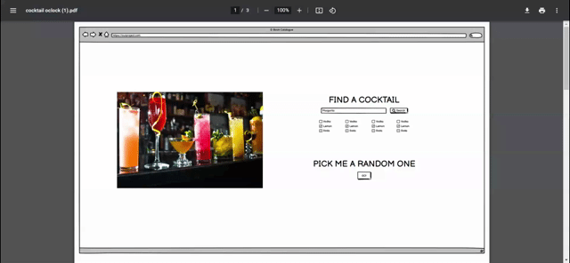
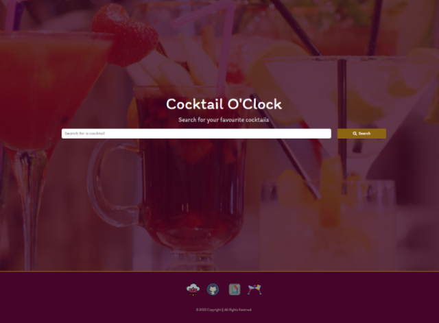
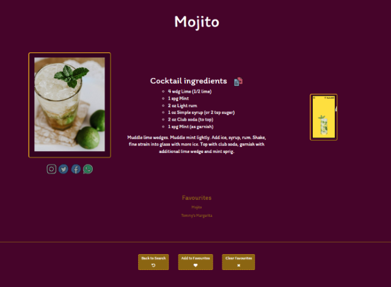

# Cocktail-O-Clock 

## Description
Cocktail-O-Clock is an dynamic interactive front-end application that seeks to inform the user about the cocktail of their choice, whilst adding a fun, entertaining element in the form a GIF.

The client informed us the application had to include the following:

- Bootstrap Components
- Interactivity - It needs to adapt to user input
- Use server-side APIs to fetch data from
- Limit the use of user-unfriendly elements like alerts, confirm and prompt pop ups.
- Be responsive on multiple device formats (phones, tablets, laptops and desktops)

The application takes user input (their choice of cocktail) and returns a page with the cocktail name, the ingredients it requires and the method to reproduce it. An image and a GIF is also provided for reference.

A list of related cocktails are provided on the side of the page, along with the option to add that specific cocktail to a 'Favourites' list.

## User Story
 <br />AS A lover of cocktails
 <br />I WANT a to be able to search for my favourite cocktails
 <br />SO THAT I know the ingredients, quantities and methods for making the perfect drink

ACCEPTANCE CRITERIA:

- Accept user input to search cocktail database
- Show an image of the cocktail where possible
- Show the ingredients for the cocktail
- Show the quantities per ingredient
- Show the method to make the cocktail
- Allow the user to view previous searches or favourite searches - store in local storage
- Ensure the site is responsive
- Ensure the UI is polished and easy to navigate

## Technologies Used

The application employs two HTML pages - a main index file, and a file where the cocktail search results are displayed alongside some related content.

Bootstrap elements were incorporated into to application in order to streamline the styling, and the app utilises media queries in order to make the site responsive across multiple viewport sizes.

## APIs used

We've utilised three API's in this project

https://www.thecocktaildb.com
https://api-ninjas.com/api/cocktail
https://developers.giphy.com/

The API-Ninja Cocktail API was used to generate the name, ingredients and method to make the cocktail
The Cocktail DB was used to generate the cocktail images
GIPHY was used for the cocktail GIF

## Challenges

### Merge Conflicts

For most of the project we were all working on seperate areas of the code so we didn't experience many issues with Git. The last couple of days however, we were all working on the same areas. Some members would be polishing the CSS, re-writing parts of the HTML and working on functions and code that depended on each other. This brought issues with conflict merges. We each had to deal with our own conflicts and in some instances and had to rewrite a small amount of code. Upon looking into this, we can stash our changes, pull the latest updates and then use stash pop to push your own changes. If we had to do this project again, I believe 

### Three APIs instead of Two
We had to use an extra API as we realised when appending the data on the page, our primary cocktail API, didn't include images! 
We made use of the Cocktail DB API to get that image, and in the future or if we had to repeat the project, we would only use the Cocktail DB.

## Successes

With everyone having a full time job, it was sometimes difficult to collaborate outside of course hours. We met twice over the weekend for a standup and to priosritise certain tasks. We always knew what we were doing. If someone was having a problem with a certain element of the design or code, someone would always be on hand to assist and pair code or talk through ideas. I think this was a good example of us making use of Agile Methodology.

### Agreement on Project

We came up with the idea of the project quickly. We had initital ideas but quickly discovered that due to API complexity / auth method, it would be difficult to implement. We moved on quickly and found the Cocktail Ninja API within the first day of the project. 

Good planning and communication within the team. 



Our initial design process. Our wire frame



## Input from each team member

Rochelle - ``` I really enjoyed working on our first team project. From the first wireframe to the last little touches with CSS and JS, everyone has contributed and supported eachother, we've all done parts of the project that perhaps we don't really enjoy. 
I found that pair programming a difficult bit of code really helped as well, but also being able to have time away on your own to try and figure stuff out has been great too. Going forward it would be good to see how others handle working on a small project with so many members and how they deal with merge conflicts, a couple of times code was overwritten and had to be added back in. ```

Nikki - ``` "For a first group project, I can say that I've had such a positive experience overall, and have really enjoyed collaborating with my team. We set out a clear plan at the beginning of our project, and we have made a real point of working together through any challenges, but equally having time away from the group setting to work independently when needed. It was a real pleasure to work together, and I feel like I learned a lot from my teammates over the course of the week." ```

Suzie - ``` "I would like to thank everyone in my team. We communicated well and always supported each other. Every single one of us had a good contribution in the project. 🥰 It was a pleasure working with you all."```

Joe -
    ``` "I felt our approach to the project was spot on! We started with a good design, which gave us a great base to work from. I originally built the skeleton of the cocktail page from the initital design. It allowed us to style and add javaScript functionality quite early on. Once a lot of the functionality was in place, the design was changed slightly to accomodate new features and design ideas.
    What I would like to improve on in the future is my commit tendancies. At the start of the project it was ok due to each team member having more specific roles in different areas of the project. However, towards the end of the project when we were all working on similiar items, we came accross more merge conflicts."```

## Usage (Screenshots / Video)

Screenshot of the Index HTML page:



Screenshot of the Cocktail HTML which displays the user's search results:





## The following GIF shows the web application's appearance and functionality:


## Installation (Link to gitHub pages and how to use app)

1. Click the link to the GitHub Pages site where the app is hosted
2. Once on the homepage, search for your cocktail of choice (E.G Martini, Negroni)
3. The cocktail page will appear and will show you the following: 
    - The cocktail name
    - The ingredients
    - The method to produce
    - An image and a GIF related to the cocktail

4. You will be given a choice of related cocktails. Clicking on them, will take you to the cocktail.
5. You'll have the option to save a cocktail to favourites. The favourite cocktail will be saven in local storage once clicked

Link to GitHub Pages: https://josephnamihas.github.io/Cocktail-O-Clock/

## Future Development Plans

If we had more time, we would implent the following:

- We would implement MomentJS and base functions around it. 
- Share cocktail page on social media
- Change the copy function to include the name of the cocktail

## Credits

https://www.w3schools.com/
https://developer.mozilla.org/en-US/

- sorada.wright@gmail.com - https://github.com/SoradaW
- rochellembradley@gmail.com - https://github.com/rbrd87
- nicola162@gmail.com - https://github.com/Nikki1162
- joenamihas@yahoo.co.uk - https://github.com/JosephNamihas 

## License

MIT License

Copyright (c) 2023 TeamHulk

Permission is hereby granted, free of charge, to any person obtaining a copy
of this software and associated documentation files (the "Software"), to deal
in the Software without restriction, including without limitation the rights
to use, copy, modify, merge, publish, distribute, sublicense, and/or sell
copies of the Software, and to permit persons to whom the Software is
furnished to do so, subject to the following conditions:

The above copyright notice and this permission notice shall be included in all
copies or substantial portions of the Software.

THE SOFTWARE IS PROVIDED "AS IS", WITHOUT WARRANTY OF ANY KIND, EXPRESS OR
IMPLIED, INCLUDING BUT NOT LIMITED TO THE WARRANTIES OF MERCHANTABILITY,
FITNESS FOR A PARTICULAR PURPOSE AND NONINFRINGEMENT. IN NO EVENT SHALL THE
AUTHORS OR COPYRIGHT HOLDERS BE LIABLE FOR ANY CLAIM, DAMAGES OR OTHER
LIABILITY, WHETHER IN AN ACTION OF CONTRACT, TORT OR OTHERWISE, ARISING FROM,
OUT OF OR IN CONNECTION WITH THE SOFTWARE OR THE USE OR OTHER DEALINGS IN THE
SOFTWARE.